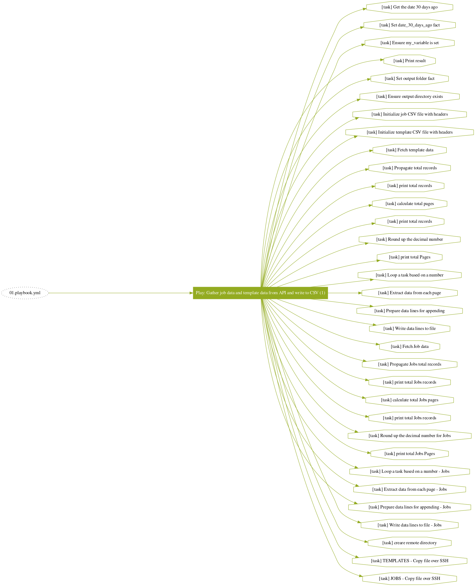

# Ansible Automation Platform Statistics Extraction and Dynamic Surveys

## Project Structure
```bash
.
├── aap_dynamicsurvey
│   ├── html
│   │   └── index.html
│   ├── playbook
│   │   ├── 01.createsurvey.yml
│   │   └── 02.create_template.yml
│   ├── README.md
│   └── scripts
│       ├── 01.azuredata.py
│       ├── 02.dummydata.py
│       └── 03.dummydata.py
├── aap_statistics
│   ├── 01.playbook.yml
│   ├── inventory.ini
│   ├── python
│   │   └── aap_data_extractor.py
│   ├── README.md
│   └── tasks
│       ├── 01.prepare-environment.yml
│       ├── 02.job-templates.yml
│       ├── 03.jobs.yml
│       └── 04.remote-directories.yml
└── README.md
```

### AAP Statistics
aap_statistics/README.md

#### AAP Statistics Playbook Structure



### AAP Dynamic Surveys
aap_dynamicsurvey/README.md
